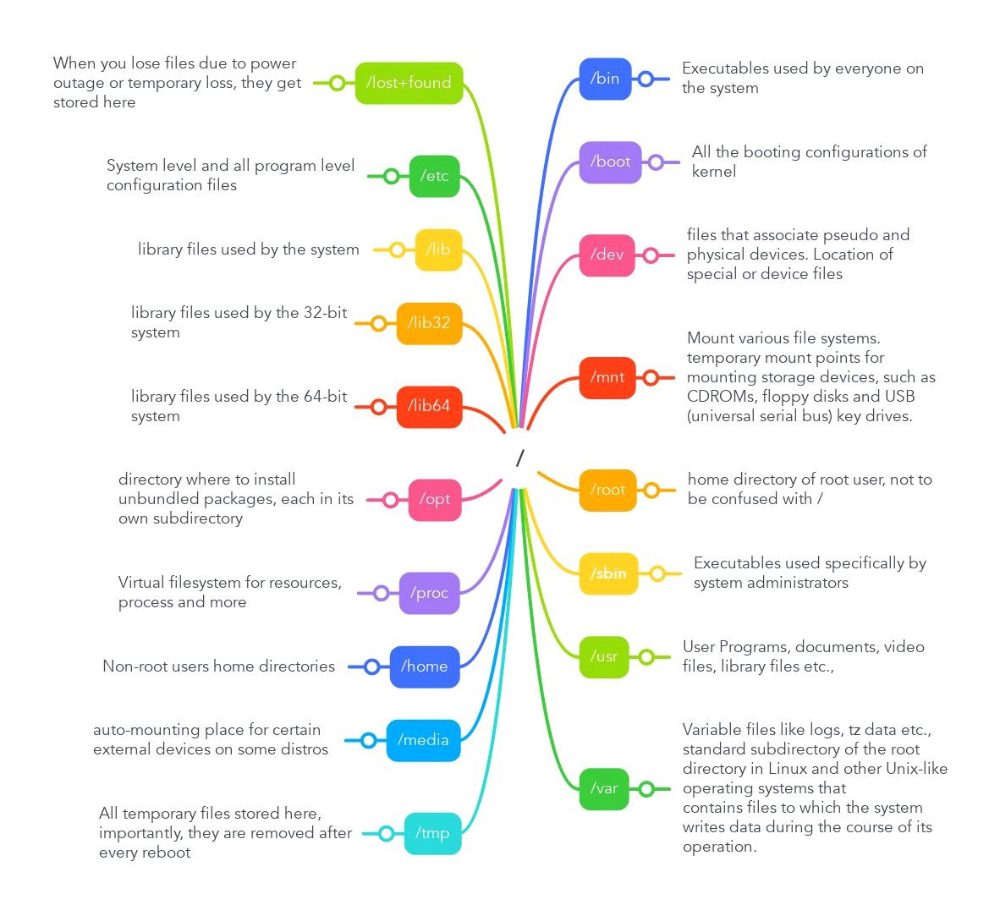

# Learn-Linux-Commands
## Table of Contents
- [1. Why Learn the Command Line](#Why-Learn-the-Command-Line)
- [2. Linux File System](#Linux-File-System) 


# Why Learn the Command Line
- More Control over machine
- It's Faster
- You can Automate Many tasks
- It's Available everywhere on servers
- It's basically a requirement

# Linux File System

Linux Filesystem Hierarchy

- `/` (Root): The top-level directory where all files and directories start.
- `/bin`: Contains essential binary executables necessary for basic system functionality.

- `/sbin`: Contains essential system binaries for system administration, typically requiring root privileges.

- `/usr`: Contains user-related programs and files, including applications and utilities.

- `/etc`: Stores system and application configuration files.

- `/home`: Contains personal directories for users, storing their personal files and settings.

- `/var`: Holds variable data like logs, mail spools, and temporary files.

- `/tmp`: Used for temporary files created by applications and services.

- `/dev`: Contains device files.

- `/boot`: Holds files required for the system boot process.

- `/lib`: Contains essential shared libraries needed to boot the system and run commands in root filesystem.

- `/media`: Mount points for removable media like USB drives.

- `/mnt`: Temporarily mounted filesystems.

- `/opt`: Optional software packages.

- `/proc`: Virtual filesystem providing process and kernel information.

- `/root`: Home directory for the root user.

- `/run`: Runtime data since the last boot.

- `/srv`: Data for services provided by the system.

- `/sys`: Contains information about devices, drivers, and kernel features
<br>



## `whoami` - To print the username of the current user
(NOT VERY USEFUL)

```bash
~ whoami
raghav
```

## `man` - To read the manual of any command
```bash
~ man ls
```
- Press `q` to quit the manual page
- Press `/` to search for any keyword in the manual page
- Press `h` to see help
- scroll using arrow keys or space bar

## `clear` - To clear the terminal screen
```bash
~ clear
```  

<b>Shorthand:</b> `Ctrl + L` 
 
## `pwd` - To print the current working directory
```bash
~ pwd
/home/raghav
```
## `ls` - To list files and directories in the current directory
```bash
~ ls
Desktop  Documents  Downloads  Music  Pictures  Videos  install.sh  README.md  app.exe
```
### Commonly used options with `ls` command:
- `-l` : Long listing format (detailed information)
- `-a` : Show all files, including hidden files (those starting with a dot)
- `-h` : Human-readable file sizes (e.g., 1K, 234M, 2G)
- `-t` : Sort by modification time, newest first
- `-r` : Reverse the order of the sort
- `-R` : Recursively list subdirectories
- `-i` : Show inode number of each file

if u add a folder name or path after `ls` it will list the contents of that folder
```bash
~ ls Documents
file1.txt  file2.txt  project
```

## `cd` - To change the current directory
```bash
~ cd Documents

~/Documents pwd
/home/raghav/Documents
```
``` bash
cd ..  # To go one directory up
cd ~   # To go to home directory
cd /  # To go to root directory
cd -` # To go to previous directory
```


<b>Note:</b> If the directory name has spaces, use quotes or escape spaces with backslashes
```bash 
cd "My Documents"
cd My\ Documents
```
<b>Note:</b> man cd doesn't work because cd is a shell built-in command. To see its documentation, use:
```bash 
help cd
```